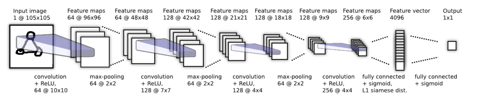

# Discriminative few Shot face Recognition and Verification

A few-shot learning method for face recognition and verification utilizes a Siamese Network Architecture. By using a triplet loss function, the model refines the embedding space to group faces of the same person together and distinguish those of different people, improving accuracy and efficiency with minimal training data. The original Siamese Network Architecture was introduced by Gregory Koch et al. in the paper ["Siamese Neural Networks for One-shot Image Recognition."](https://www.cs.cmu.edu/~rsalakhu/papers/oneshot1.pdf)

## Siamese Network Architecture

## Requirement
| No | Name | Version |
|----------|----------|----------|
| 1 | cuda  | 12.2 |
| 2 | nvidia driver | 535.104.05 |
| 3 | tensorflow | 2.15.0 |
| 4 | retinaface | 0.0.17 |
| 5 | mtcnn | 0.1.0 |
| 6 | openface | 19.24.4 |
| 7 | cv2 | 4.9.0 |

## Dataset
#### Positive Classes
The positvie class for this project was collected by ourselves from webcam and cropped to be 100x100 pixels. If more datasets is needed it is possible to get a dataset from kaggle using this [link](https://www.kaggle.com/datasets/vasukipatel/face-recognition-dataset?resource=download)

#### Negative classes
- The Negative class is collected from [labeled faces in the wild dataset](https://vis-www.cs.umass.edu/lfw/#download)

#### Anchor Classes
- The anchor class contains a copy of shuffled positive class

### Trained Model(.hs format)
- The trained model cab be downloaded [here](https://drive.google.com/file/d/1MslUExsEdewxx0RyH5_wB1QsKaguWzth/view?usp=drive_link) and be used for inference. 

## Presentation
Presentation of this project is [here](https://docs.google.com/presentation/d/1r6ZgzKJysU0XE2EPFiR20TBGDD3QVMhU/edit?usp=sharing&ouid=101643233388980217770&rtpof=true&sd=true)

## References
1. [https://www.cs.cmu.edu/~rsalakhu/papers/oneshot1.pdf](https://www.cs.cmu.edu/~rsalakhu/papers/oneshot1.pdf)
2. https://www.sitepoint.com/keras-face-detection-recognition/
